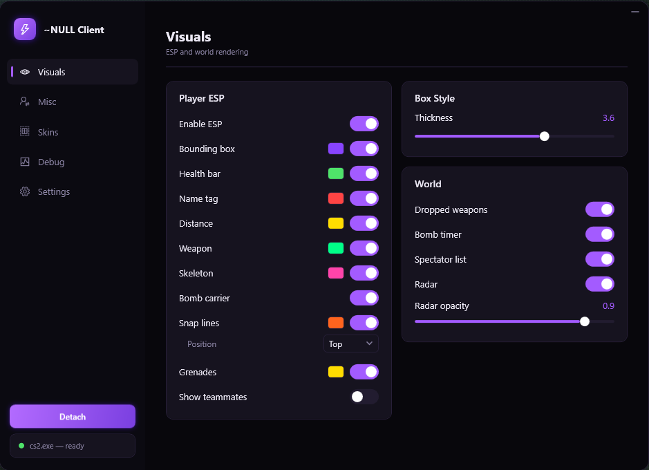
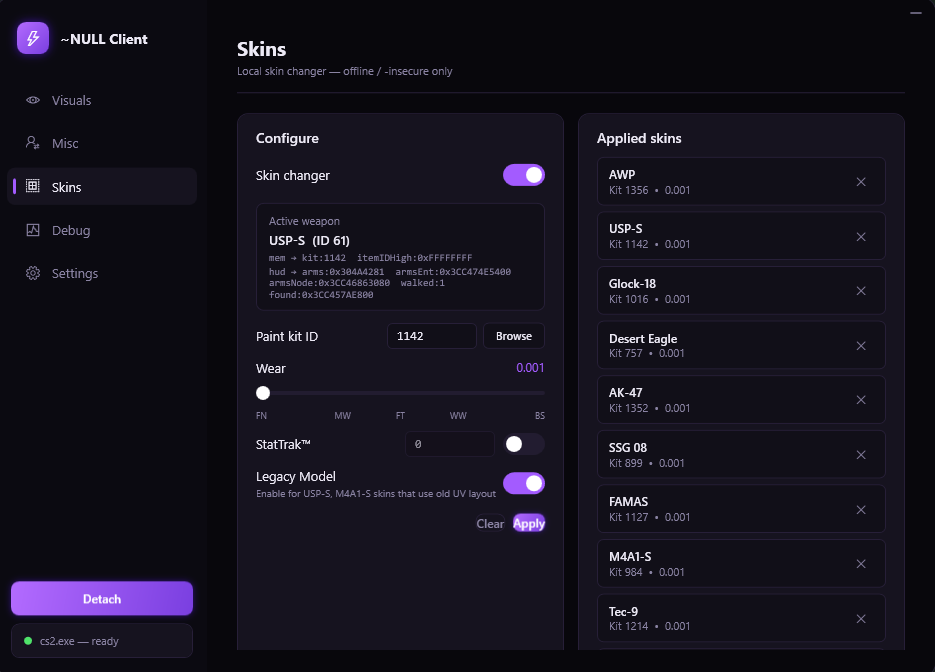
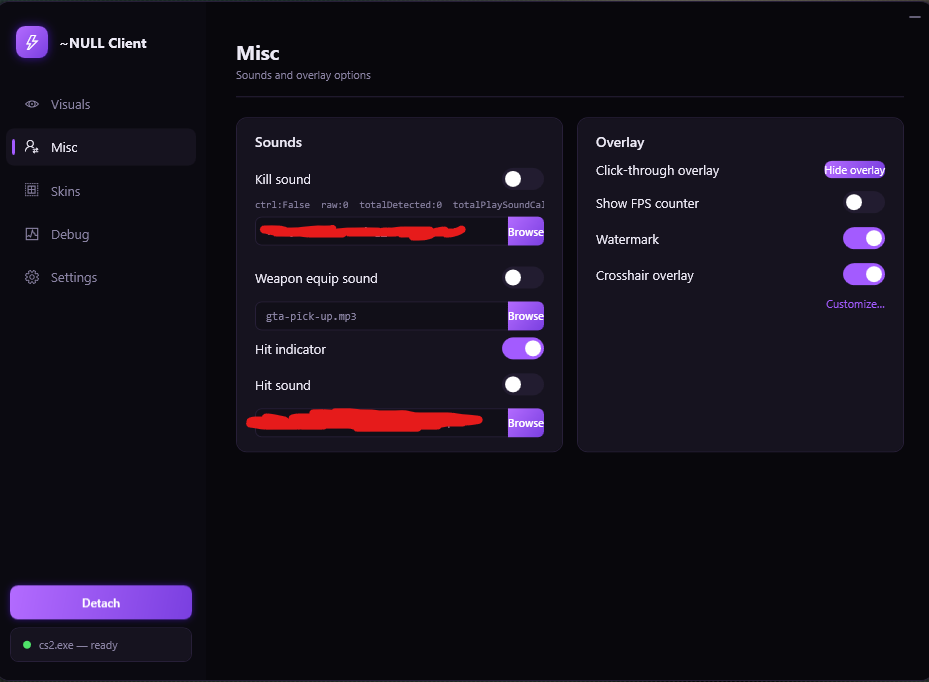
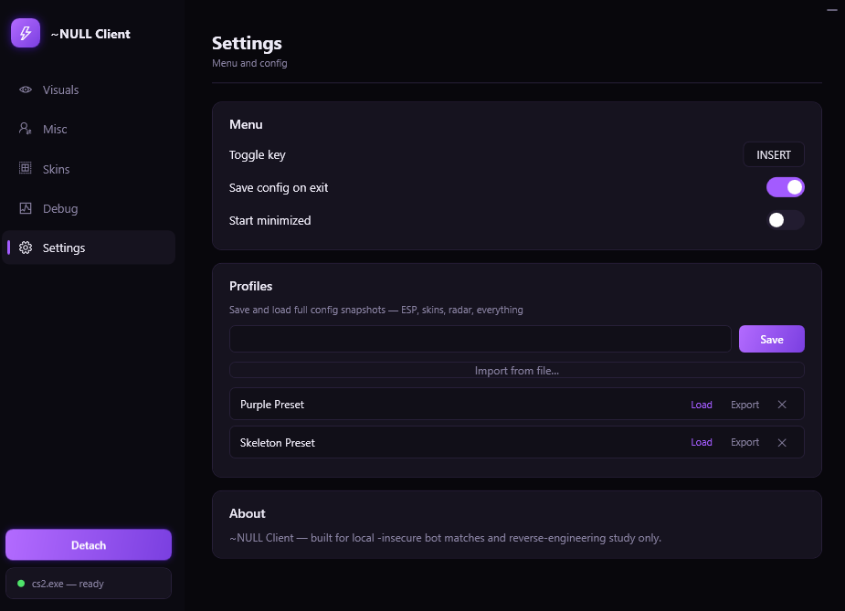
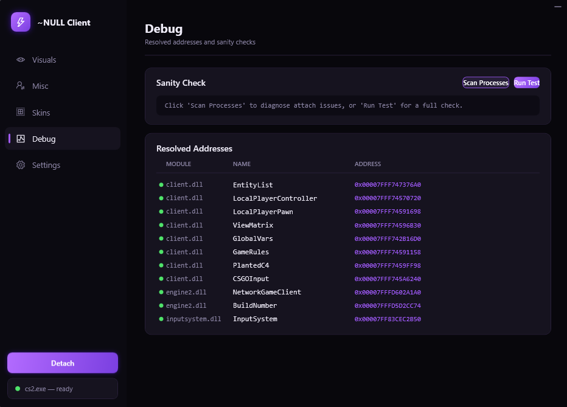

# Counter-Strike 2 External

This project was fun to build and helped me learn a lot of new things.

> [!WARNING]
> This project is **not intended for use in actual matches**, and I am **not responsible for any damage, penalties, or bans applied to your account**. 🫵

## ✨ Features

### 👁️ Visuals

* Bounding Boxes
* Health Bars
* Name Tags
* Distance Display
* Weapon Names
* Skeleton ESP (Real Bone Projection)
* Bomb Carrier Indicator
* Snap Lines
* Grenade ESP with Landing Prediction
* Dropped Weapon ESP
* Per-Feature Color Customization
* Adjustable Box Thickness
* Team Filtering
* Spectator List Toggle
* Radar Toggle
* Radar Opacity Control

### 🔊 Misc

* Kill Sound
* Weapon Equip Sound
* Custom Sound File Browser
* Hit Indicator
* Hit Sound
* Click-Through Overlay Toggle
* FPS Counter
* Watermark
* Crosshair Overlay

  * Custom Colors
  * Hex Color Support
  * Adjustable Size
  * Adjustable Thickness
  * Adjustable Gap
  * Center Dot Toggle
  * Live Preview Window

### 🎨 Skins

* Weapon Skin Changer

  * Paint Kit
  * Wear
  * Seed
  * StatTrak™
  * Legacy Model Toggle
* Searchable Skin Browser
* Weapon Selection Menu
* Thumbnail Grid from the Public CS2 Item Schema
* Knife Skins (Paint-Only)
* Applied Skins List
* Remove Applied Skins

> [!NOTE]
> Knife **types** are not changed by the skin changer. Switching knife types requires the appropriate in-game console command.

### 🧪 Debug

* Process Scan
* Runtime Sanity Checks
* Resolved Offset Address Table

### ⚙️ Settings

* Toggle Key Display
* Save on Exit
* Start Minimized
* Config Profile System

  * Save Profiles
  * Load Profiles
  * Delete Profiles
  * Import Profiles
  * Export Profiles
* About Section

### 🪟 Floating Overlay Windows

#### Spectator List

* Separate Draggable Window

#### Radar

* Rotates with Player View
* Draggable
* Position Persistence
* Displays Players
* Displays C4 (Planted or Dropped)
* Displays Grenades

## 📸 Screenshots

<strong>Visuals</strong>

 

  

<strong>ESP (Front View)</strong>

 

  

<strong>ESP (Back View)</strong>

 

  

<strong>Skin Changer</strong>

 

  

<strong>Misc Features</strong>

 

  

<strong>Settings</strong>

 

  

<strong>Debug</strong>

 

  

## 📌 Project Notes

> [!IMPORTANT]
> The Aimbot tab was intentionally removed and is no longer included.

> [!WARNING]
> Glove support was fully implemented but is currently disabled due to stability issues during match transitions. It may be revisited in the future.
